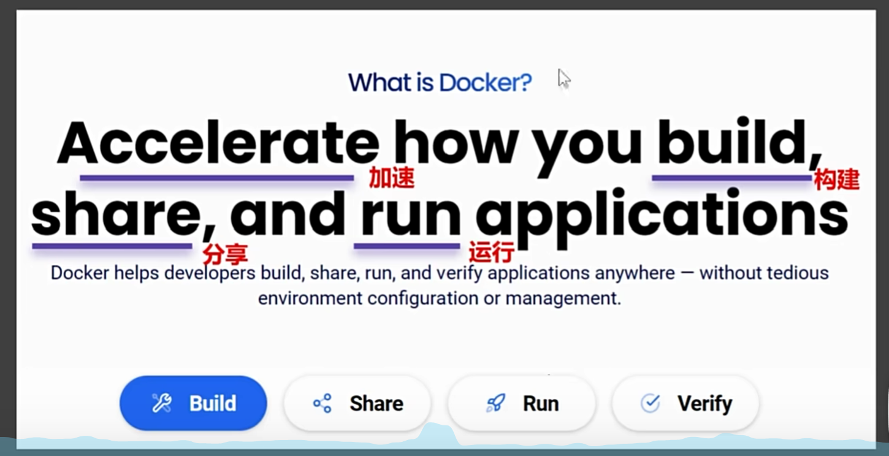

## 为什么要有docker

### 传统部署方式
- 安装虚拟机
- 安装操作系统
- 安装软件
- 安装依赖
- 执行许多命令
- 更改配置文件
- 等等等的操作

### docker
可以将软件打成一个软件包；
实现一行命令快速启动应用

### 镜像文件
不同的软件，不同的版本，都可以打包成镜像文件。类似软件商店。
用户(服务器厂商)只需要访问dockerhub即可以访问到这些文件

### 构建、分享、运行
docker官网对于docker的定义
快速的构建、分享、和运行。对于docker的学习也是围绕这3点进行的。
