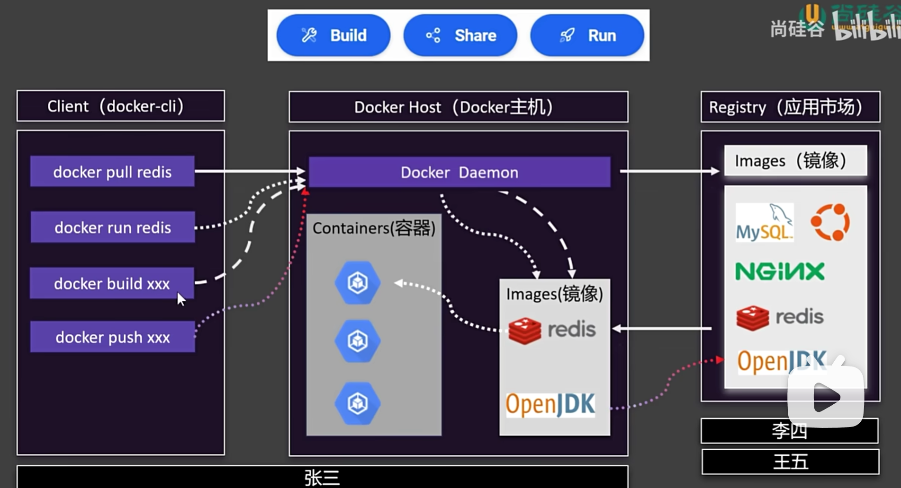
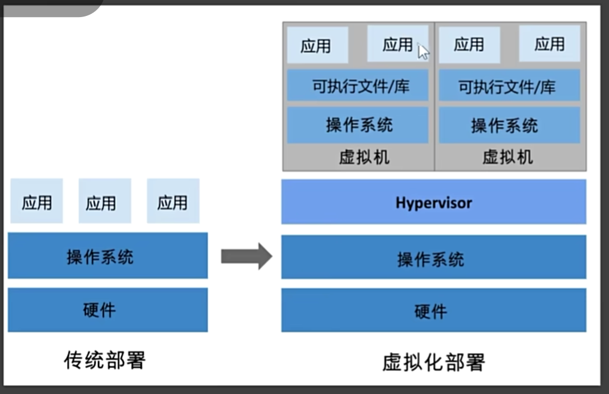

## docker架构与容器化

### build share run
以下是docker的架构图：

#### docker pull
从dockerhub下载镜像文件

#### docker run
运行镜像文件，启动容器

#### docker build
构建镜像文件

#### docker push
上传镜像文件到dockerhub

### 容器
传统部署方式，多个应用部署在一台服务器上  
一台服务器出现问题(内存泄露、磁盘满了、网络中断、服务器宕机等等)，会导致所有应用都无法运行。  
又出现了虚拟化技术，将服务器虚拟成多个服务器，每个服务器上都可以运行多个应用。

虽然解决了问题，但是每个虚拟机都是一个独立的操作系统，且模拟出了硬件，会占用大量的资源。  
docker容器：类似轻量级的虚拟机，既起到分离的作用，又不会占用大量资源。  
容器共享操作系统的内核，每个容器拥有自己的文件系统、网络配置、进程空间、用户ID等。
