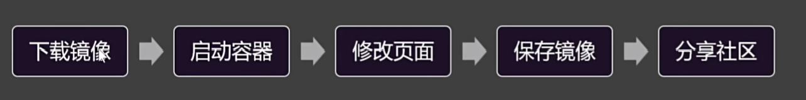
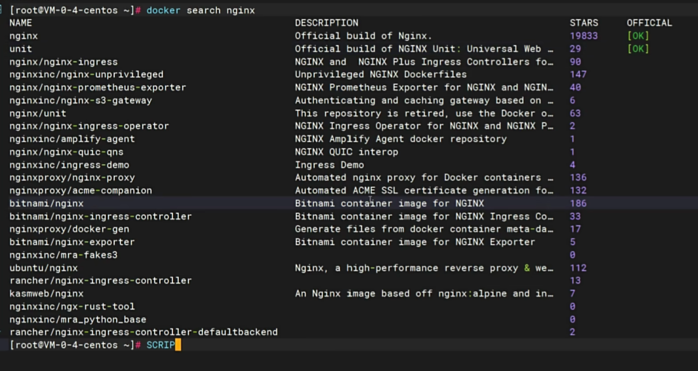
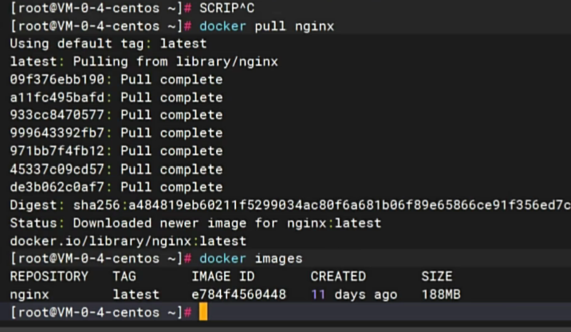
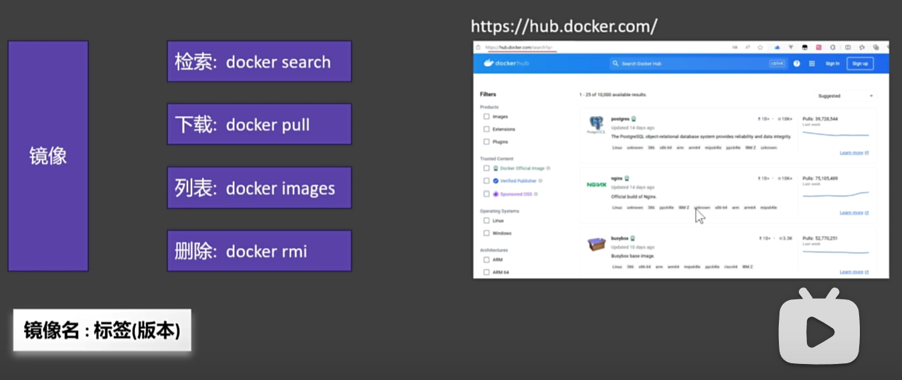

## 07-镜像操作
要求：启动一个nginx，并将首页改为自己的首页，发布出去，让所有人都能使用

### 步骤

### 查找、下载镜像
- docker search nginx  
出现如下结果：  
名称 描述  星星数量 是否官方镜像
  

- docker pull nginx  
下载镜像  
- docker images
查看镜像（docker image ls）

- docker rmi  
删除镜像(i 表示image，没有i表示操作的容器)

### 镜像
完整的镜像是由镜像名:标签组成的  
要找到完整的镜像名，需要在dockerhub上搜索  
docker pull nginx 其实是下载了nginx:latest标签的镜像  
