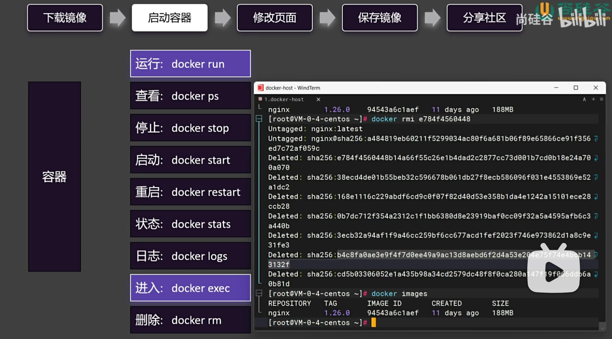

## 容器操作
使用以下命令，操作docker容器:  

### docker run  
[OPTIONS] IMAGE [COMMAND] [ARG...]  
- image后跟的参数，通常不用写，由镜像自带。除非需要改变镜像默认配置。  
- option 参数项  
- 简单写法：docker run image

### docker ps
查看运行中的容器
- -a 查看所有容器，包括已停止的容器

### docker start
- 指定容器id或者name启动容器

### docker restart
-无论是否运行、停止，都重新启动容器

### docker stats
- 查看容器状态，CPU、内存、网络等

### docker rm
- 删除容器，只能删除已停止的容器；或者使用-f强制删除
