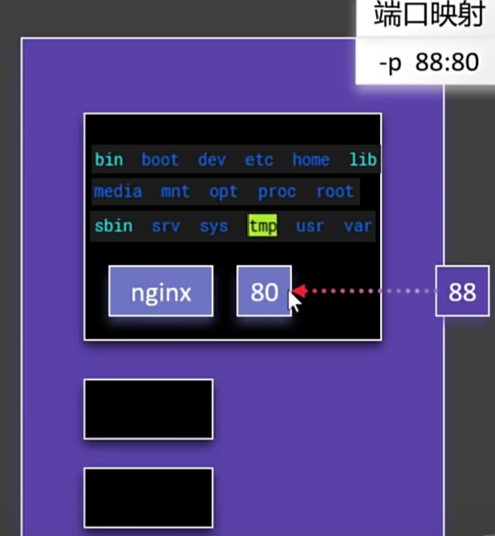
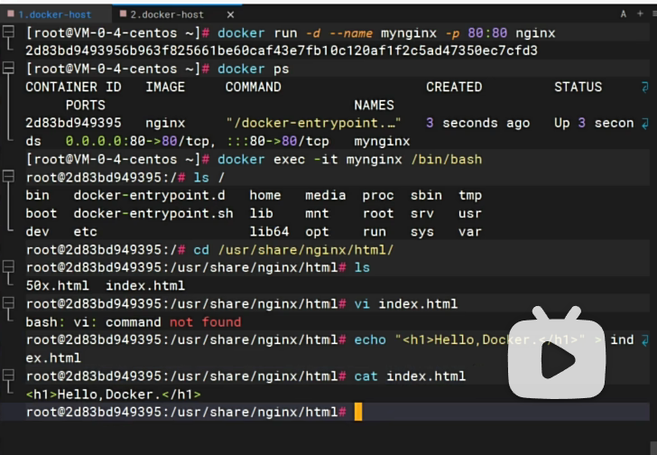

## docker run 细节

### docker run -d --name nginx-01 nginx
- -d 后台运行容器
- --name nginx-01 指定容器名称

### -p 88:80
- 用以上命令启动后，需要加上-p 88:80，才能访问到nginx的首页  
因为容器内部的nginx是80端口，需要端口映射到宿主机的88端口  

- docker run -d --name mynginx-01 -p 88:80 nginx

### 端口88不能重复，80可以重复
80是每个容器的端口，每个容器间是互相独立的  
88是主机端口

### docker exec
- 进入容器内部，执行命令，修改nginx的首页
- it 交互模式  
- /bin/bash 进入系统bash shell命令
- docker exec -it mynginx-01 /bin/bash

### 使用ehco命令，修改nginx的首页

### exit 退出容器