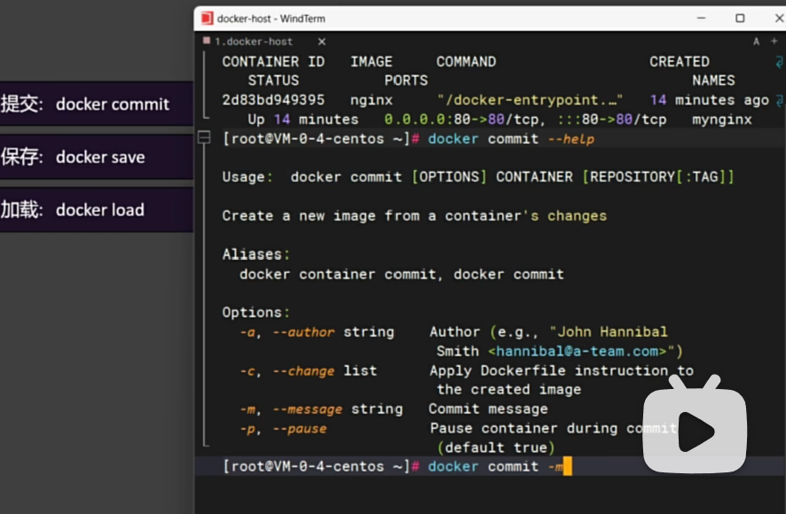

## 保存镜像

### docker commit nginx01 mynginx:v01
- -m 提交的描述信息
- mynginx-01 容器名称
- nginx:v01 镜像名称和版本
- docker commit  -m "update index.html" mynginx-01 nginx:v01

### docker save
- 保存镜像到本地
- -o 保存的文件名
- docker save -o nginx.tar nginx:V01 （将自己本地运行的nginx:V01 保存为 nginx.tar，以便提供给别人或自己下次使用）

### docker load
- 加载本地镜像文件（*.tar）到本地
- -i 加载的文件名
- docker load -i nginxV01.tar (记载本地镜像文件nginxV01.tar)

