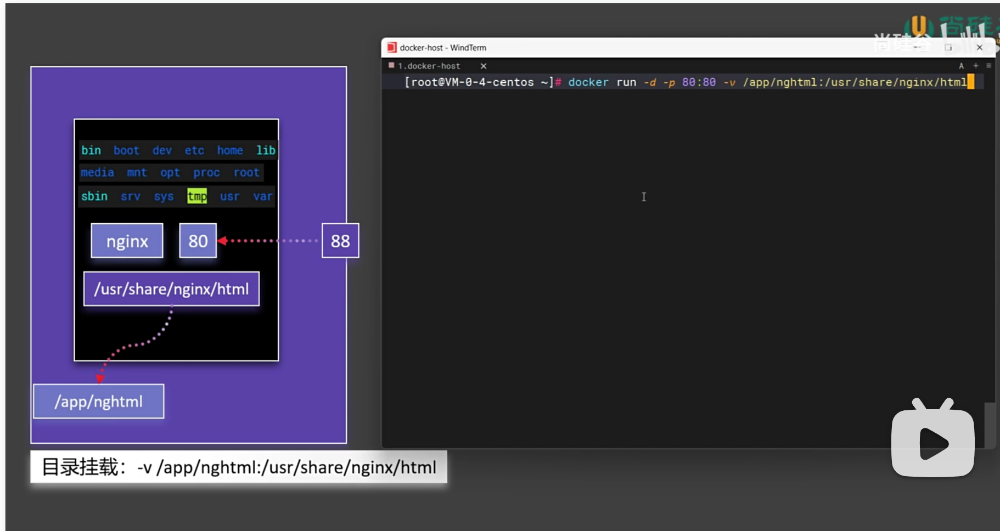

## 目录挂载

### docker ps -aq
- -a 查看所有容器
- q 只显示容器id

### docker rm -f $(docker ps -aq)
- 删除所有容器

### docker exec mynginx01 bash
- 进入容器

### 目录挂载
每次使用docker exec修改容器内部文件,配置等，都不是持久化的。  
在删除容器后，修改的内容都会丢失。  
docker提供了目录挂载的功能，将容器内部的目录，映射到宿主机的目录。

run命令使用-v参数，将容器内部的目录，映射到宿主机的目录。  
-v /app/nghtml:/usr/share/nginx/html

当删除的容器时，外部创建的目录并会被删除，是持久化的。