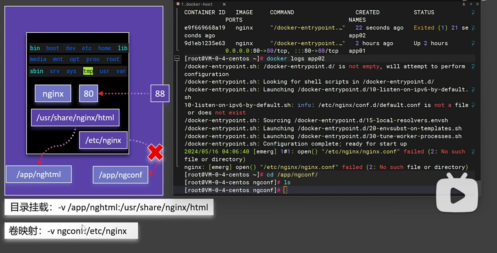

## 卷映射
- 无法直接挂载容器中 /etc/nginx，因为创建的主机目录是空文件夹，无法启动容器。
- 使用卷映射，将主机目录挂载到容器目录。

- 将创建的ngconfig目录放在了docker主机的/var/lib/docker/volumes/<卷名>/_data目录下

- 目录挂载和挂在卷的区别：

  - 挂在目录是以 /开头。启动时以主机挂在目录为主，如果宿主机目录没有内容会影响容器启动。
  - 挂在卷没有 / 开头，只有一个目录名。启动时以容器内容为主。
  - 目录挂载：外部文件/文件夹挂载到内部文件/文件夹 
  - 卷映射：内部文件/文件夹映射到外部文件/文件夹 配置文件采用目录挂载的方式启动容器时，由于外部文件/文件夹此时是空的，就会启动容器失败，所以需要采用卷映射。

- 卷操作命令

  - docker volume ls ：查看所有卷

  

  - docker volume inspect ngconf ：查看卷详情 

    

  - xxx