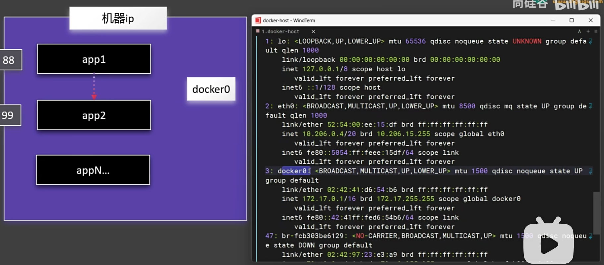
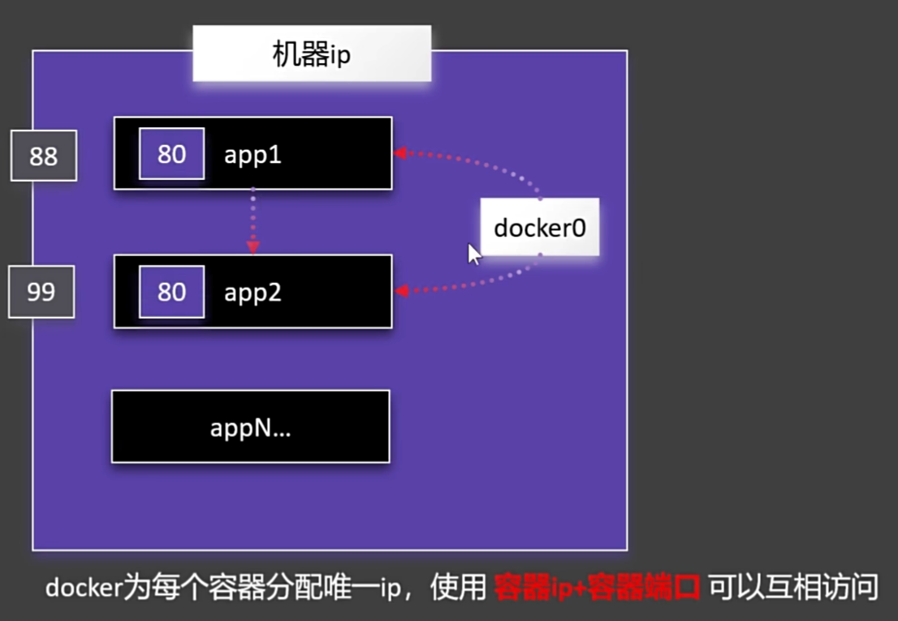

## 自定义网络
docker容器在启动的时候，为每个容器提供了一个docker0的虚拟网络。

### docker container inspect app1
查看app1容器的网络信息  
在容器中使用docker0分配的容器ip+容器端口即可访问  
存在ip地址可能会变化的缺点

### docker network
- docker0默认不支持主机名访问，使用自定义网络可以用容器名访问
- docker network create mynet
- docker network ls

### 使用定义网络创建容器
- docker run -d --name app1 --network mynet nginx
- 可以使用容器名访问