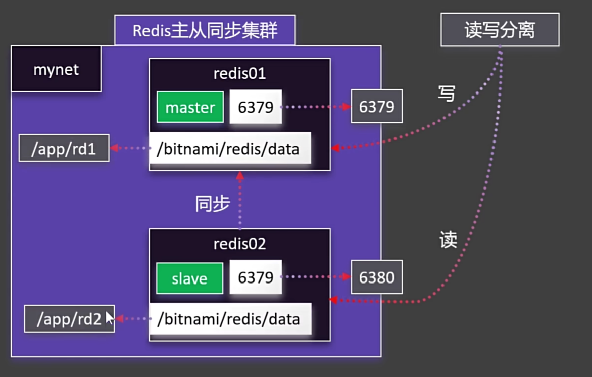
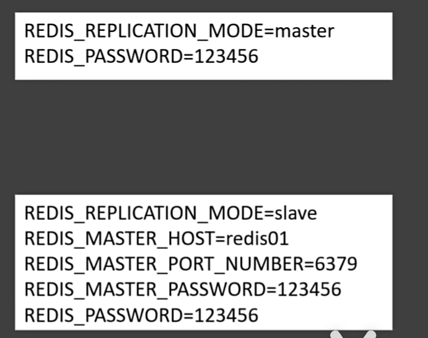
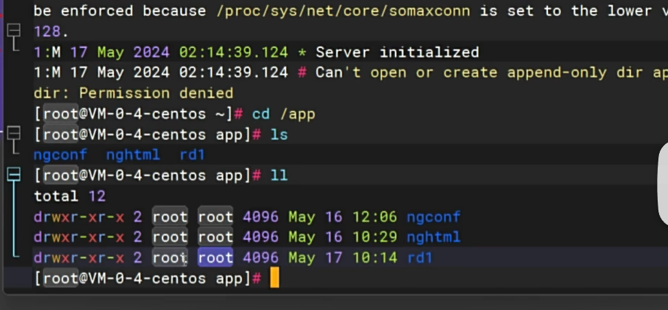

## redis主从集群
- 创建两个容器redis02 redis02，一主一从，实现读写分离
- 创建docker自定义网络mynet
- 使用目录挂载，将redis持久化的数据备份到主机
- 修改redis01 redis02的配置文件（环境变量）

### bitnami版本的redis镜像
- 支持主从集群
- 支持以环境变量的形式配置redis 
### 自定义网络
docker network create mynet 
### 主节点
docker run -d -p 6379:6379 \
-v /app/rd1:/bitnami/redis/data \
-e REDIS_REPLICATION_MODE=master \
-e REDIS_PASSWORD=123456 \
--network mynet --name redis01 \
bitnami/redis

-v 挂载目录
-e 环境变量
--network 网络
--name 容器名

### 从节点
docker run -d -p 6380:6379 \
-v /app/rd2:/bitnami/redis/data \
-e REDIS_REPLICATION_MODE=slave \
-e REDIS_MASTER_HOST=redis01 \
-e REDIS_MASTER_PORT_NUMBER=6379 \
-e REDIS_MASTER_PASSWORD=123456 \
-e REDIS_PASSWORD=123456 \
--network mynet --name redis02 \
bitnami/redis

### 启动失败
docker ps 查看无正在运行的redis01容器  
docker logs redis01 查看日志
发现是挂载目录没有权限
解决：chmod 777 /app/rd1
