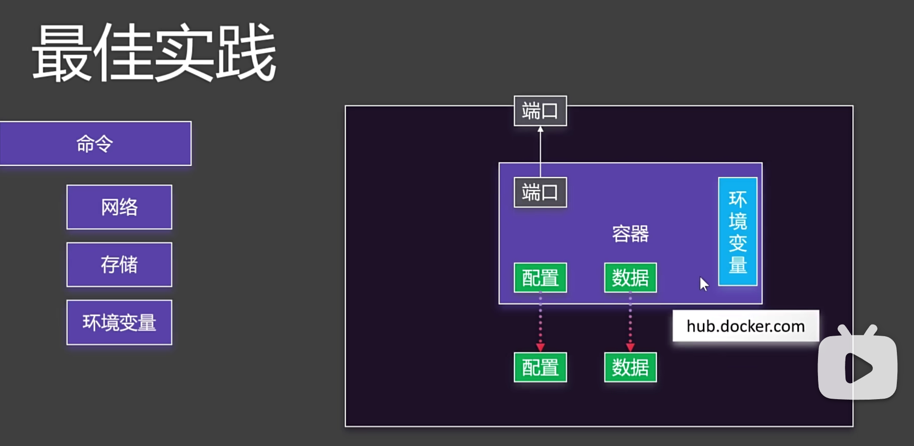

## 最佳实践
启动docker容器时需要注意的参数：
- -d 后台运行
- -p 端口映射
- -v 卷映射（目录挂载）
- --name 容器名称
- --network 自定义网络
- -e 环境变量

### 启动mysql容器
docker run -d -p 3306:3306 \
-v /app/myconf:/etc/mysql/conf.d \ ---- 空目录不存在没有文件不能启动的问题
-v /app/mydata:/var/lib/mysql \
-e MYSQL_ROOT_PASSWORD=123456 \
mysql:8.0.37-debian

