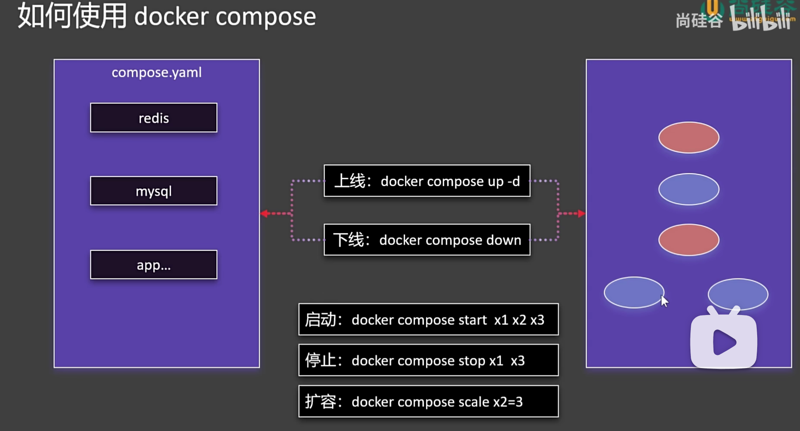
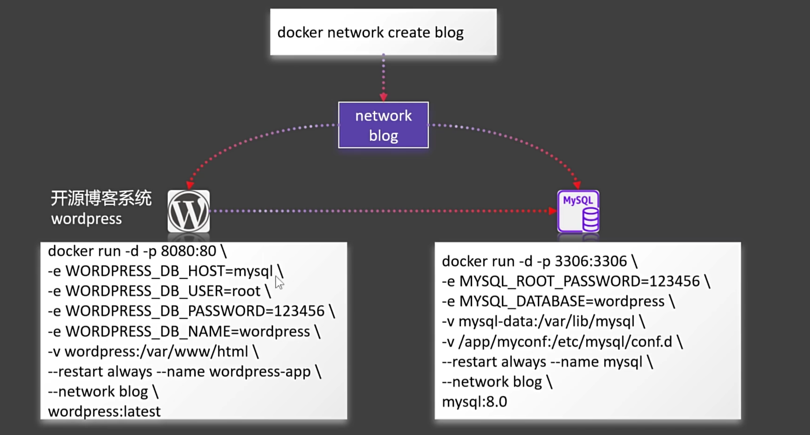

## docker compose 安装博客
使用docker compose，批量的管理容器
- 批量上线，下线容器
- 启动、停止、扩容、缩容容器
- docker compse scale x2=3 : 扩容3个 x2容器，一共三个x2
- 

### 使用docker启动开源博客系统wordpress
- 自定义网络blog `docker network create bolg`
- 启动mysql容器
- 启动wordpress容器

```bash
docker run -d -p 3306:3306 \
-e MYSQL_ROOT_PASSWORD=123456 \
-e MYSQL_DATABASE=wordpress \
-v mysql-data:/var/lib/mysql \
-v /app/myconf:/etc/mysql/conf.d \
--restart always --name mysql \
--network blog \
mysql:8.0

docker run -d -p 8080:80 \
-e WORDPRESS_DB_HOST=mysql \
-e WORDPRESS_DB_USER=root \
-e WORDPRESS_DB_PASSWORD=123456 \
-e WORDPRESS_DB_NAME=wordpress \
-v wordpress:/var/www/html \
--restart always --name wordpress-app \
--network blog \
wordpress:latest
```





### compose.yaml 基本内容


### 安装mysql和webpress

- 安装 mysql yaml 内容


- 安装 wordpress 的yaml内容


- 清理以前安装的内容


- 启动


> docker compose -f compose.yaml up -d
>
> 如果文件名为 compose.yaml ，-f compose.yaml 可以不写

- 查看启动


