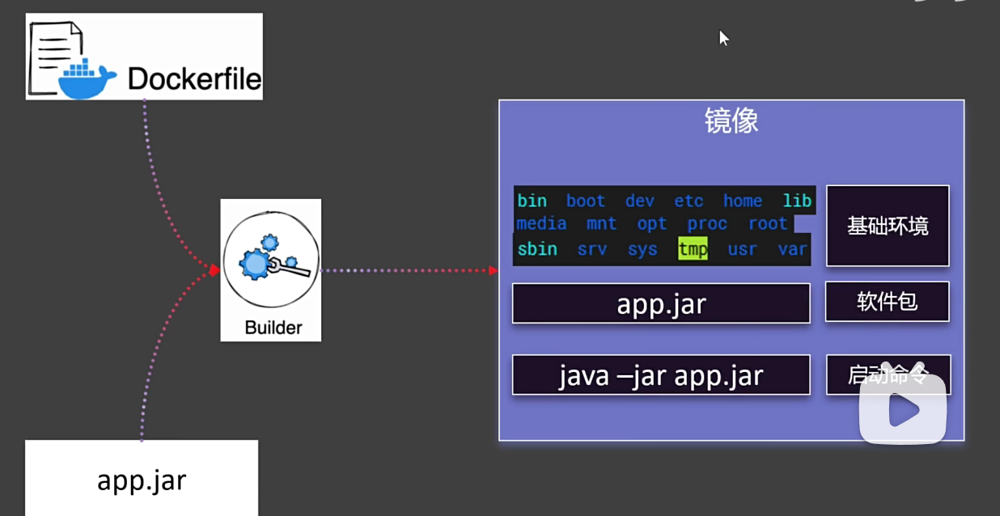
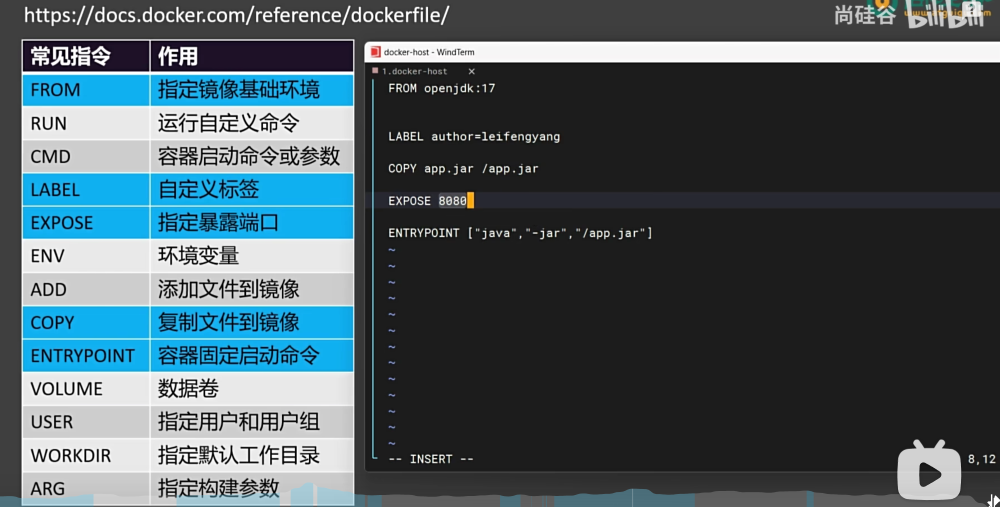

## 制作镜像
制作镜像需要的步骤：
- linux基础环境
- 软件包
- 启动命令

### docker file
docker file常用命令：
- FROM 指定基础镜像
- Label 镜像信息
- COPY 复制文件
- EXPOSE 暴露端口
- ENTRYPOINT 启动命令

### docker build
docker build -f DockerFile -t myJavaapp:v1.0 .
- -f 指定dockerfile文件
- -t 指定镜像名称和标签
- . 表示当前目录下（很重要）

- 启动制作好的镜像

https://doc.docker.com/reference/dockerfile/

最右下角：Dockerfile examples 查看其它语言的dockerfile文件制作。
