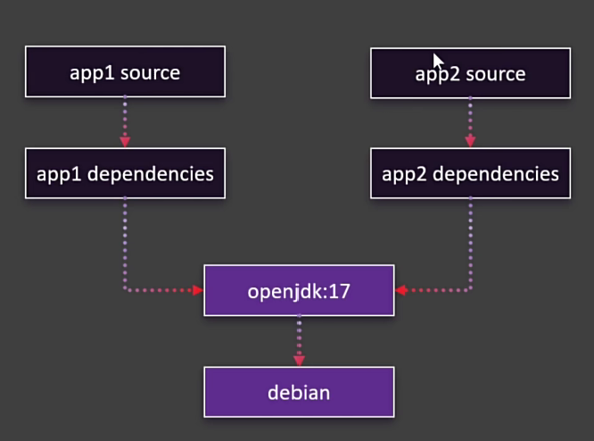
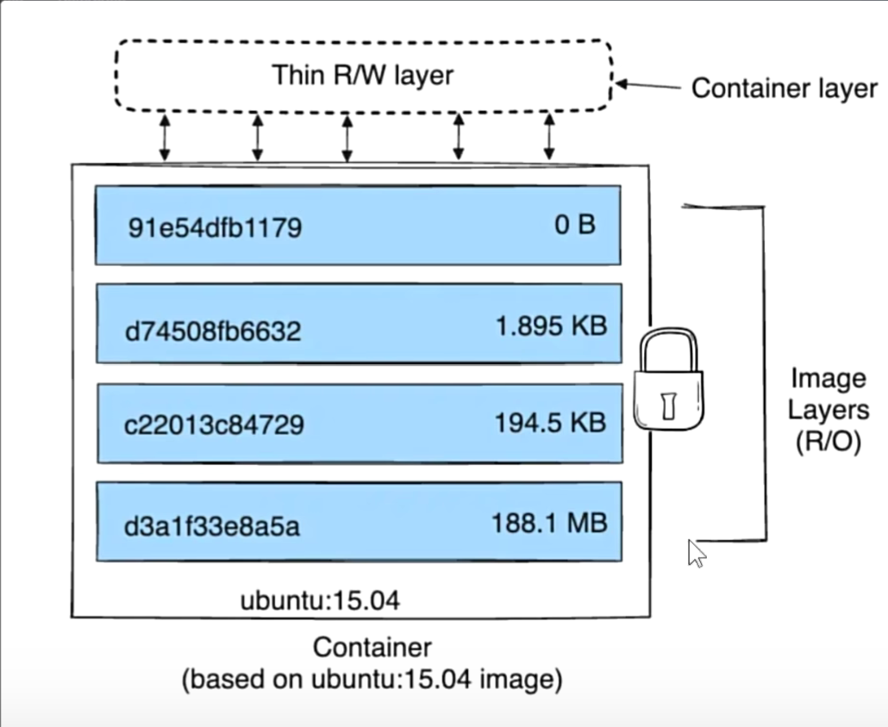
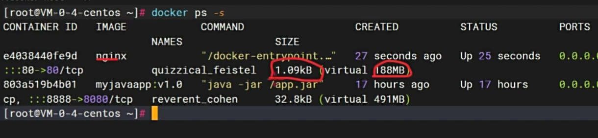

## 镜像分层

docker 镜像存在分层的概念，每个镜像都是由多个层组成的。
app1 和 app2 都是基于openjdk17和debain的镜像，  
app1和app2镜像实际只存储了自己增量的部分  
同一层的文件，只会存储一份。 且可以共享。

### 镜像与容器存储机制
每个镜像都是由多个层组成的，每个层都是只读的。
容器是在镜像的基础上，添加了一层可写/读层。

docker ps 查看容器，可以看到created 188M，是容器镜像大小，size是容器实际修改大小。
